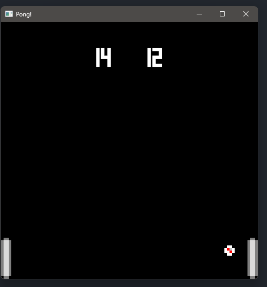

## Pong-Game in Rust
- This is a game implemented in Rust with Amethyst crate.
- There are two paddles in the game, means two people can play the game together but on the same device(Cause this is a offline game).
- Players have to prevent ball the to touch the left or right side of the screen.
- There is a scoreboard where players can see there scores.
- It's a never-ending game, which means two quit the game you need to forcefully stop the game.

### How to start ?

```
cargo run
```

### Screenshot
